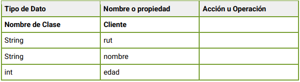
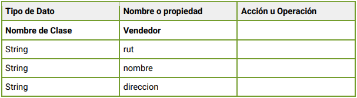
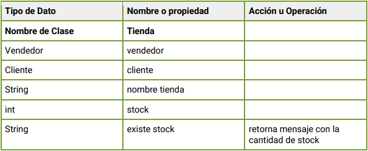

Desafío - Sistema Automotora (Parte II)
--

- En este desafío validaremos nuestros conocimientos vistos en las sesiones anteriores.
Lee todo el documento antes de comenzar el desarrollo individual o grupal, para asegurarte
de tener el máximo de puntaje y enfocar bien los esfuerzos.

Descripción

- Para desarrollar el siguiente desafío necesitamos haber realizado el desafío Sistema
Automotora (Parte I), ya que se le agregaron nuevos requerimientos.

- La automotora solicita agregar al sistema una tienda donde trabaja un vendedor y recibe
muchos clientes, tiene un nombre de tienda y stock de productos, la tienda tiene una
funcionalidad llamada “existe stock” el cual nos retorna la cantidad de stock del producto.

Los datos son los siguientes:

Requerimientos

Utilizando el diagrama de clases realizado en el Desafío - Sistema Automotora (Parte I):
1. Identificar las nuevas relaciones y el nuevo objeto.
   (2 Puntos)

2. Crear nuevos objetos con sus relaciones y características.
   (4 Puntos)

3. Crear el diagrama de clases de la información reunida con sus atributos, operaciones
   y relaciones según corresponda.
   (4 Puntos)
